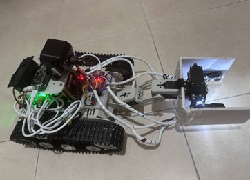
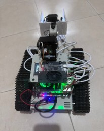

# 🤖 Protectoron - AI-Powered Autonomous Defense Robot

<div align="center">



[](LICENSE)
[](https://www.python.org/)
[](https://www.raspberrypi.org/)
[](https://github.com/ultralytics/yolov5)

### BSc Final Project in Electrical and Electronics Engineering
**Braude College of Engineering, Karmiel, Israel**

*November 4, 2025 | י״ג בְּחֶשְׁוָן תשפ״ו*

[View Demo](Resources/Auto%20Pilot.mp4) • [System Setup](Resources/אופן%20הפעלת%20הפרויקט.MOV) • [Documentation](DataSheets/)

</div>

---

## 📋 Table of Contents

- [Overview](#-overview)
- [Problem Statement](#-problem-statement)
- [Key Features](#-key-features)
- [System Architecture](#-system-architecture)
- [Hardware Components](#-hardware-components)
- [Software Stack](#-software-stack)
- [Control Methods](#-control-methods)
- [Communication Architecture](#-communication-architecture)
- [Installation & Setup](#-installation--setup)
- [Usage](#-usage)
- [Future Improvements](#-future-improvements)
- [Team](#-team)
- [References](#-references)
- [License](#-license)

---

## 🎯 Overview

**Protectoron** is an intelligent AI-powered autonomous defense robot designed to detect, identify, and safely handle potentially dangerous objects in hazardous environments. The system integrates advanced artificial intelligence, computer vision, and real-time remote control capabilities to protect human lives by operating in dangerous scenarios where human presence would be risky.

The robot features a sophisticated multi-server architecture with distributed processing, combining:
- **Real-time object detection** using YOLO (You Only Look Once)
- **Hand gesture recognition** using MediaPipe
- **Multi-modal control systems** (voice, gesture, remote web interface, PS2 controller)
- **Autonomous navigation** with sensor fusion
- **3-DOF robotic arm** for object manipulation



---

## ⚠️ Problem Statement

### The Challenge

Modern security threats require innovative solutions to protect human lives:

| Challenge | Impact | Statistics |
|-----------|--------|------------|
| 🔴 Explosive Devices & Suspicious Objects | Civilian casualties in public spaces | **25,276** injuries from suspicious packages |
| 🔴 Military Operations in Enemy Territory | Soldiers entering hostile zones | **18,500** IDF casualties (Oct 7, 2023 War) |
| 🔴 Unexploded Ordnance & Rocket Debris | Contact with undetonated missiles/shrapnel | **1,100** casualties from rocket interception debris |

### Our Solution

Protectoron provides a **safe, autonomous alternative** by:
- Operating in high-risk environments without endangering human operators
- Providing real-time visual feedback and object detection
- Enabling remote control from safe distances
- Offering multiple redundant control systems for reliability

---

## ✨ Key Features

### 🤖 Autonomous Capabilities
- **AI-Powered Object Detection**: YOLO-based real-time detection and classification
- **Color Recognition**: Dual verification (visual + TCS230 color sensor)
- **Distance Measurement**: Ultrasonic sensors (HC-SR04) for precise navigation
- **Gesture Control**: MediaPipe hand gesture recognition for intuitive operation

### 🎮 Multiple Control Methods
1. **Local Control**
   - PS2 Wireless Controller (2.4GHz RF, up to 15m range)
   - Voice Command System (Yahboom voice recognition module)
   
2. **Remote Control**
   - Full Web Dashboard Interface (Wi-Fi/TCP)
   - Hand Gesture Control System (Pi4-based)


### 🛠️ Robotic Manipulation
- **3-DOF Robotic Arm** with 15kg serial bus servos
- **2-DOF Camera Platform** for pan-tilt tracking
- **Tracked Chassis** with hall encoder motors for precise movement
- **Real-time Video Streaming** via HTTP MJPEG

### 🔒 Reliability & Safety
- **Distributed Server Architecture** for fault tolerance
- **Heartbeat Monitoring** with automatic reconnection
- **Timeout & ACK Protocol** for command verification
- **Fail-Safe Mode** with PS2 controller fallback

---

## 🏗️ System Architecture

### Server Architecture

The system employs a **distributed multi-server architecture** for reliability and performance:

```
┌─────────────────────────────────────────────────────────────────┐
│                     Backend Server (Windows)                    │
│                    FastAPI + YOLO Detection                     │
│                      Port: 8000 (Main)                          │
└────────────────────────────┬────────────────────────────────────┘
                             │
    ┌─────────────────┬──────┴───────┬─────────────────┐
    │                 │              │                 │
┌───▼────┐     ┌──────▼─────┐  ┌────▼─────┐   ┌──────▼──────┐
│  Pi 5  │     │    Pi 4    │  │  ESP32   │   │ PS2 (USB)   │
│ Motors │     │  Gestures  │  │ Sensors  │   │  Fallback   │
│ Camera │     │  Port:5000 │  │ WebSocket│   │  2.4GHz RF  │
│ Serial │     │ MediaPipe  │  │ Distance │   │   15m Range │
└────────┘     └────────────┘  └──────────┘   └─────────────┘
```

#### Component Roles

| Component | Role | Technology |
|-----------|------|------------|
| **Backend Server** | Main processing, AI detection, decision making | FastAPI, YOLO, Python, Windows PC |
| **Raspberry Pi 5** | Motor control, camera streaming, physical execution | Python, Serial UART, HTTP MJPEG |
| **Raspberry Pi 4** | Hand gesture recognition and processing | MediaPipe, OpenCV, Python |
| **ESP32** | Sensor data collection (distance, color) | WebSocket, C++ |
| **PS2 Controller** | Emergency manual control (fallback) | 2.4GHz RF, HID Protocol |

### Why Multiple Servers?

1. **Modularity**: Each component handles specific tasks
2. **Fault Tolerance**: System continues if one server fails
3. **Performance**: Distributed processing prevents bottlenecks
4. **Scalability**: Easy to add new capabilities

---

## 🔌 Hardware Components

### Processing Units
- **Windows PC** - Main Backend Server (Intel/AMD CPU with GPU for YOLO)
- **Raspberry Pi 5** - Robot Control & Execution
- **Raspberry Pi 4** - Gesture Recognition
- **ESP32-WROOM-32** - Sensor Hub
- **STM32F103** - Motor Driver Controller

### Sensors & Actuators
- **Raspberry Pi Camera v2** (8MP) - Main vision system
- **Raspberry Pi Camera v2** (8MP) - Gesture recognition
- **HC-SR04 Ultrasonic Sensor** - Distance measurement
- **TCS230 Color Sensor** - Object color verification
- **ICM-20602/40607 IMU** - Inertial measurement
- **520 DC Gear Motors** with Hall Encoders
- **15kg Serial Bus Servos** (3x for arm, 2x for camera platform)

### Display & Interface
- **3.5" TFT Touch Screen** (Uctronics U6111)
- **0.91" OLED Display** (128x32, I2C)
- **Yahboom Voice Module** - Speech recognition

### Power & Chassis
- **Yahboom Transbot-SE** tracked chassis
- **AM2857 H-Bridge Motor Driver**
- Portable power modules

For detailed component specifications, see [DataSheets/](DataSheets/).

---

## 💻 Software Stack

### Backend (Windows PC)
```python
FastAPI          # Web server framework
YOLO (Ultralytics) # Object detection
OpenCV           # Computer vision
WebSocket        # Real-time communication
asyncio          # Asynchronous operations
```

### Raspberry Pi 5
```python
Python 3.8+      # Main language
PySerial         # Motor/servo control
OpenCV           # Video streaming
WebSocket Client # Server communication
```

### Raspberry Pi 4
```python
MediaPipe        # Hand gesture recognition
OpenCV           # Video processing
FastAPI          # Local web server
```

### ESP32
```cpp
Arduino Framework
WebSocket Library
Color Sensor Library
Ultrasonic Library
```

---

## 🎮 Control Methods

### 1. Local Control Systems

#### 🎙️ Voice Control System


- Natural language command processing
- Yahboom voice recognition module
- Supports Hebrew and English commands
- Real-time response feedback

#### 🎮 PS2 Wireless Controller


- **Emergency Fallback System**
- Direct connection to Pi5 via USB dongle
- 2.4GHz RF communication
- Range: Up to 15 meters
- Works independently of main server
- HID protocol for universal compatibility

### 2. Remote Control Systems

#### 🌐 Web Control Dashboard


**Features:**
- Real-time video streaming with AI overlay
- Full robot control (movement, arm, camera)
- System telemetry and status
- Object detection visualization
- Log monitoring
- Multi-device access (desktop, tablet, mobile)

**Access:** Connect to robot's Wi-Fi network and navigate to the web interface.

#### 👋 Hand Gesture Control


**Supported Gestures:**
- ✋ Open hand: Stop
- ✊ Fist: Move forward
- 👆 Point up: Camera up
- 👇 Point down: Camera down
- 👈 Point left: Turn left
- 👉 Point right: Turn right
- 🤏 Pinch: Grab object

**Technology:** MediaPipe Hands solution with custom gesture classification

---

## 🌐 Communication Architecture

### Network Topology

```
                    ┌─────────────────────┐
                    │   Backend Server    │
                    │   (Windows PC)      │
                    │   192.168.x.x:8000  │
                    └──────────┬──────────┘
                               │
                    ┌──────────┴──────────┐
                    │    Wi-Fi Network    │
                    │     (TCP/IP)        │
                    └──┬─────┬────────┬───┘
                       │     │        │
           ┌───────────┘     │        └─────────────┐
           │                 │                      │
    ┌──────▼──────┐   ┌──────▼──────┐        ┌──────▼──────┐
    │  Pi5 Robot  │   │  Pi4 Gesture│        │   ESP32     │
    │  WebSocket  │   │  Port: 5000 │        │  WebSocket  │
    │  HTTP Video │   │  WebSocket  │        │  Sensors    │
    └─────────────┘   └─────────────┘        └─────────────┘
```

### Communication Protocols

| Protocol | Purpose | Components | Characteristics |
|----------|---------|------------|-----------------|
| **WebSocket** | Real-time bidirectional control | Backend ↔️ Pi5, Pi4, ESP32 | Persistent connection, low latency |
| **HTTP MJPEG** | Video streaming | Pi5 → Backend | Frame-by-frame, easy YOLO integration |
| **Serial UART** | Hardware control | Pi5 → Motors/Servos/Voice | Direct, fast, precise |
| **2.4GHz RF** | Manual control | PS2 → Pi5 (USB) | Wireless, 15m range, fallback |

### Data Flow

```
User Input (Web/Voice/Gesture/PS2)
           ↓
    Backend Server
    • Validates command
    • Checks safety (ESP32 sensors)
    • Processes with AI if needed
           ↓
      WebSocket
           ↓
    Raspberry Pi 5
    • Translates to Serial commands
    • Executes on hardware
           ↓
    Motors/Servos/Voice Module
           ↓
    Physical Action
           ↓
    Feedback (Video/Sensors)
           ↓
    Backend & User Interface
```

### Example Command Flow

**Scenario:** Move robot forward via web interface

```json
// 1. Frontend → Backend (WebSocket)
{
  "command": "move",
  "velocity": 0.3,
  "angular": 0
}

// 2. Backend validates and forwards → Pi5 (WebSocket)
{
  "type": "motor",
  "left": 30,
  "right": 30
}

// 3. Pi5 translates to Serial command → Motors
"M 30 30\n"

// 4. Pi5 sends acknowledgment → Backend
{
  "type": "ack",
  "status": "success",
  "command_id": "xyz123"
}
```

**Execution time:** < 100ms for complete round-trip

---

## 🔧 Network Management & Reliability

### Fault Tolerance Features

#### 1. Heartbeat Monitoring
- Every component sends "alive" signal every 2-5 seconds
- Server detects disconnection and initiates reconnection
- Automatic session recovery

#### 2. Timeout & Acknowledgment (ACK)
- Every command requires confirmation (ACK)
- Timeout period: 5 seconds
- Automatic command cancellation if no ACK received
- Prevents "zombie" commands

#### 3. Progressive Reconnection
- **Attempt 1:** Immediate retry
- **Attempt 2:** Wait 2 seconds
- **Attempt 3:** Wait 5 seconds
- **Attempt 4:** Wait 10 seconds
- **Continues** until connection restored

#### 4. Fail-Safe Mode
If Backend server fails completely:
- PS2 controller automatically takes over
- Direct control of Pi5
- Basic movement and arm control maintained
- System continues operation without AI features

### Asynchronous Architecture (asyncio)

The system uses Python's `asyncio` for concurrent operations:

```python
# Multiple tasks run simultaneously without blocking:
- Video streaming from Pi5
- Sensor data from ESP32
- Command processing from web interface
- AI object detection with YOLO
- Heartbeat monitoring
- Log management
```

**Benefits:**
- Near-instant response time
- No blocking operations
- Efficient resource utilization
- Smooth multi-tasking

---

## 📥 Installation & Setup

### Prerequisites

**Hardware:**
- Windows PC with GPU (NVIDIA recommended for YOLO)
- Raspberry Pi 5 with camera module
- Raspberry Pi 4 with camera module
- ESP32 development board
- All components listed in [Hardware Components](#-hardware-components)

**Network:**
- Wi-Fi router or access point
- All devices on same local network

### Backend Server Setup (Windows PC)

```bash
# Clone repository
git clone https://github.com/FrancisA2000/Protectoron-Intelligent-AI-Autonomous-Defense-Robot-BSc-EEE-Final-Project.git
cd Protectoron-Intelligent-AI-Autonomous-Defense-Robot-BSc-EEE-Final-Project

# Create virtual environment
python -m venv venv
venv\Scripts\activate

# Install dependencies
pip install fastapi uvicorn websockets opencv-python ultralytics mediapipe

# Configure settings
# Edit config.json with your network settings

# Run backend server
python backend_server.py
```

### Raspberry Pi 5 Setup (Robot Controller)

```bash
# Update system
sudo apt update && sudo apt upgrade -y

# Install Python dependencies
pip3 install opencv-python pyserial websockets

# Enable camera and serial
sudo raspi-config
# Enable: Camera, Serial Port (disable serial console)

# Clone robot control code
git clone [robot-pi5-repo]
cd robot-pi5

# Run robot controller
python3 robot_controller.py
```

### Raspberry Pi 4 Setup (Gesture Recognition)

```bash
# Install MediaPipe
pip3 install mediapipe opencv-python fastapi uvicorn

# Clone gesture recognition code
git clone [gesture-pi4-repo]
cd gesture-pi4

# Run gesture server
python3 gesture_server.py
```

### ESP32 Setup (Sensor Hub)

```bash
# Install Arduino IDE or PlatformIO
# Open ESP32 sensor code
# Configure Wi-Fi credentials
# Upload to ESP32 board
```

### Network Configuration

**All devices must be on the same network:**

```
Backend Server:  192.168.1.100:8000  (example)
Pi5 Robot:       192.168.1.101
Pi4 Gesture:     192.168.1.102:5000
ESP32 Sensors:   192.168.1.103
```

Update IP addresses in configuration files accordingly.

---

## 🚀 Usage

### Starting the System

1. **Power on all components:**
   - Backend server
   - Raspberry Pi 5 (robot)
   - Raspberry Pi 4 (gestures)
   - ESP32 (sensors)

2. **Launch Backend Server:**
   ```bash
   cd backend
   python backend_server.py
   ```

3. **Access Web Interface:**
   - Open browser: `http://[backend-ip]:8000`
   - Login with credentials
   - Dashboard will show live video feed

### Control Operations

#### Via Web Dashboard:
1. **Movement:** Use on-screen joystick or WASD keys
2. **Camera Control:** Arrow buttons for pan/tilt
3. **Arm Control:** Sliders for each joint
4. **Autonomous Mode:** Click "Auto Pilot" button

#### Via Voice Commands:
- "Move forward" / "קדימה"
- "Turn left" / "שמאלה"
- "Stop" / "עצור"
- "Grab object" / "אחוז חפץ"

#### Via Hand Gestures:
- Position hand in front of Pi4 camera
- Perform gestures from supported list
- System responds within 100ms

#### Via PS2 Controller:
- Connect USB dongle to Pi5
- Power on PS2 controller
- Controls mapped to standard gamepad layout

### AI Object Detection

When autonomous mode is enabled:
1. YOLO continuously analyzes video feed
2. Detected objects highlighted with bounding boxes
3. Color sensor verifies object properties
4. Distance calculated via ultrasonic sensor
5. Robot can autonomously navigate to object
6. Arm extends to manipulate object

**Watch Demo:**


---

## 🔮 Future Improvements

### Planned Enhancements

#### 🌡️ Thermal Imaging
- Add thermal camera module
- Detect heat signatures
- Identify living beings vs objects
- Night vision capability

#### 🗺️ Advanced Navigation
- SLAM (Simultaneous Localization and Mapping)
- GPS integration for outdoor operation
- Dynamic obstacle avoidance
- Pre-planned patrol routes

#### 🤖 Multi-Robot Coordination
- Deploy multiple robots simultaneously
- Central command server
- Collaborative detection and response
- Load balancing and area coverage

#### 🔐 Security Integration
- Connect to emergency services (police, military)
- Operator identification and authorization
- Facial recognition for access control
- Encrypted communication channels

#### 📱 Enhanced User Interface
- Mobile app (iOS/Android)
- AR/VR control interface
- Real-time analytics dashboard
- Cloud-based monitoring

#### 🧠 AI Improvements
- Larger custom-trained YOLO model
- Specific threat object database
- Behavioral analysis (suspicious activity)
- Multi-modal AI (vision + audio + thermal)

---

## 👥 Team

This project was developed as a BSc Final Project in Electrical and Electronics Engineering at **Braude College of Engineering, Karmiel**.

### Project Members

**Bshara Habib**
- Email: bshara.eee@outlook.com
  
**Francis Aboud**
- Email: FrancisAboud2000@gmail.com


### Supervisors & Acknowledgments

We would like to thank:
- Our academic supervisors at Braude College
- The Electronics Engineering Department
- The Computer Science Department
- Yahboom Robotics for hardware support
- The open-source community (including [OpenCV](https://opencv.org/), [YOLO](https://github.com/ultralytics/ultralytics), and [MediaPipe](https://mediapipe.dev/))

---

## 📚 References

### Academic Resources
1. Yahboom TRANSBOT-SE ROS AI vision robot car
2. Raspberry Pi Foundation Documentation
3. ESP32 Technical Reference Manual
4. OpenCV Documentation and Tutorials
5. YOLO (Ultralytics) Official Documentation
6. MediaPipe Hand Tracking Guide

### Key Technologies
- **FastAPI:** Modern Python web framework
- **YOLO:** Real-time object detection
- **MediaPipe:** ML solutions for hand tracking
- **OpenCV:** Computer vision library
- **WebSocket:** Real-time communication protocol
- **asyncio:** Asynchronous I/O framework

### Related Publications
- Socket Programming in Python (Real Python)
- Guide to TCP/IP Networks
- Raspberry Pi Camera Module Documentation
- STM32 Microcontroller Reference Manual

For complete references and datasheets, see [DataSheets/README.md](DataSheets/README.md).

---

## ⚖️ License

This project is provided for **educational and academic purposes** as part of a BSc Final Project.

- **Code:** Available for educational use with attribution
- **Hardware Designs:** Reference designs, check manufacturer licenses
- **Documentation:** Creative Commons Attribution-NonCommercial 4.0
- **Datasheets:** Refer to original manufacturer licensing terms

See [LICENSE](LICENSE) file for details.

---

## 📞 Contact & Support

For questions, collaboration, or more information:

- **Project Repository:** [GitHub](https://github.com/FrancisA2000/Protectoron-Intelligent-AI-Autonomous-Defense-Robot-BSc-EEE-Final-Project)
- **Email:** bshara.eee@outlook.com, FrancisAboud2000@gmail.com
- **Institution:** Braude College of Engineering, Karmiel, Israel

---

<div align="center">

### 🌟 We hope this project receives recognition as an outstanding final project 🌟

**Built with ❤️ for safety and innovation**

*November 2025 | Braude College of Engineering*


</div>
